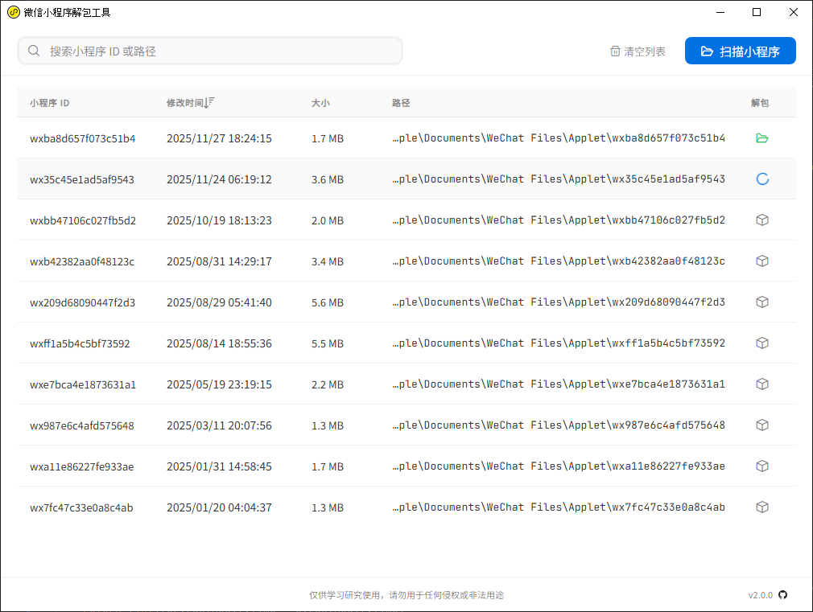

# wxapkg

> **免责声明**：此工具仅限于学习和研究软件内含的设计思想和原理，用户承担因使用此工具而导致的所有法律和相关责任！作者不承担任何法律责任！

基于 [Wails](https://wails.io) 构建的微信小程序 (`.wxapkg`) 解密与解包桌面工具，支持 Windows 与 macOS。



## ✨ 功能

- [x] 自动扫描微信小程序安装目录
- [x] 手动指定小程序文件、目录或安装目录
- [x] 解析并还原成小程序原始源码文件结构
- [x] 代码美化（JSON / HTML / JavaScript）
- [ ] 获取小程序信息

## ⚒️ 安装

直接从 [Releases](https://github.com/wux1an/wxapkg/releases) 下载对应平台的预编译版本，双击运行即可。

## 🛠️ 自行编译

环境安装

```bash
# 安装 Wails CLI（自动安装 Go 依赖）
go install github.com/wailsapp/wails/v2/cmd/wails@latest

# 安装前端依赖
cd frontend && npm install && cd ..
```

编译运行

```bash
wails build    # 构建到 build/bin/
wails dev      # 开发模式（热更新）
```

## 🔗 参考

- 小程序解密: https://github.com/BlackTrace/pc_wxapkg_decrypt
- 小程序解包: [https://gist.github.com/Integ/bcac5c21de5ea3...](https://gist.github.com/Integ/bcac5c21de5ea35b63b3db2c725f07ad)
- 原理介绍: [https://misakikata.github.io/2021/03/%E5%BE%...](https://misakikata.github.io/2021/03/%E5%BE%AE%E4%BF%A1%E5%B0%8F%E7%A8%8B%E5%BA%8F%E8%A7%A3%E5%8C%85/)